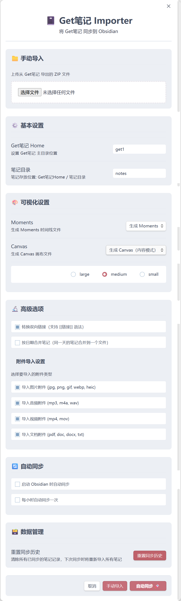

# 📓 Get笔记 Importer for Obsidian

<div align="center">

A plugin to sync your [Get笔记](https://www.biji.com/) (Get Notes) content into Obsidian with incremental sync, auto-sync, and multiple visualization options.

一个将 [Get笔记](https://www.biji.com/) 的内容同步到 Obsidian 的插件。支持增量同步、自动同步和多种可视化方式。

[](https://opensource.org/licenses/MIT)
[](https://obsidian.md/)

[English Documentation](README.en.md) | [中文文档](#)

[功能特性](#-功能特性) • [安装](#-安装) • [使用指南](#-使用指南) • [常见问题](#-常见问题) • [贡献](#-贡献)

</div>

---

## 🎉 Version 3.7.0 最新更新

### ✨ 新增功能

- **📊 全局配额管理器**：统一管理 OpenAPI 的 read / write / write_note 三类配额，所有模块共享配额状态，避免重复查询和状态不一致
- **📈 配额可视化面板**：主界面和侧边栏实时显示剩余配额（今日/月度），低于阈值时自动警告，配额耗尽时显示重置倒计时
- **🔔 配额熔断机制**：收到 API 配额耗尽错误时自动停用相关功能，避免在最坏时机被强制中断

### 🔧 优化改进

- **🎨 "动静分离"架构重构**：将持久配置迁移到系统原生的插件设置选项卡中，弹窗 Modal 仅作为交互式任务执行器
- **⚙️ 设置面板优化**：配置项按功能分组，提升用户体验和可维护性

### 🐛 问题修复

- **空文件夹创建问题**：修复了在某些情况下创建空文件夹的问题
- **OpenAPI 调用次数统计**：修复了配额消耗追踪不准确的问题

---

## 📋 版本历史亮点

### V3.6.0 - 配置管理重构
- 🎨 "动静分离"架构：持久配置迁移到插件设置选项卡
- ⚙️ 设置面板按功能分组优化

### V3.5.0 - 双向同步
- 🔄 OpenAPI 双向同步：Obsidian ↔ Get 笔记真正双向同步
- 🖼️ 图片笔记上传：支持本地图片自动上传（SHA-256 全局去重）
- 🗑️ 远端删除同步：检测云端已删除笔记并按策略处理
- 🌳 父子笔记关系：本地文件夹层级与云端 parent_id 双向映射
- 🔀 冲突合并 UI：三栏对比界面交互式解决冲突

### V3.4.0 - 语义检索（RAG）
- 🔍 OpenAPI 语义检索：集成云端向量语义检索能力
- 📌 侧边栏检索面板：实时显示相关云端内容
- ✏️ 划词搜索：选中文本快速触发语义检索
- 🎯 智能结果展示：区分本地/云端内容，支持一键同步

### V3.3.0 - OpenAPI 同步通道
- 🚀 OpenAPI 同步通道：基于 REST API 的新同步方式
- 📚 知识库同步：支持自有和订阅的知识库
- 👥 订阅博主同步：抓取关注创作者的内容
- 🎙️ 直播转写同步：同步 AI 转写的直播内容
- 🌳 多级父子目录树：还原云端笔记嵌套关系
- 📱 移动端支持：OpenAPI 通道完美支持移动端
- 🎯 统一命名规范：采用 Obsidian 社区最佳实践

---

## ✨ 功能特性

### 核心功能

- ✅ **双通道同步**：支持传统 Playwright + ZIP 导出和 OpenAPI REST API 两种同步方式
- ✅ **增量同步**：智能识别已同步的笔记，只导入新增内容，避免重复
- ✅ **智能更新检测**：自动识别 Get笔记 中修改过的笔记并重新导入
- ✅ **附件按类型导入**：可选择性导入图片、音频、视频、文档四类附件，灵活控制存储空间
- ✅ **原文链接提取**：自动提取并保存原文链接到 YAML frontmatter
- ✅ **多种同步方式**：
  - 启动时自动同步
  - 定时自动同步（可配置间隔）
  - 手动一键同步
  - 手动导入 ZIP 文件

### OpenAPI 高级功能

- 🔄 **双向同步**：Obsidian ↔ Get 笔记真正双向同步，支持本地创建/修改/删除笔记推送到云端
- 📚 **知识库同步**：同步自有知识库和订阅的外部知识库，按专题维度组织笔记
- 👥 **订阅博主同步**：抓取关注的创作者（抖音、微信、得到等）发布的内容到本地
- 🎙️ **直播转写同步**：同步已完成 AI 转写的直播内容（含 AI 摘要和完整转写文本）
- 🔍 **语义检索（RAG）**：集成云端向量语义检索能力，支持全局召回和知识库内召回
- 🖼️ **图片笔记上传**：自动识别 Markdown 中的本地图片，通过 OSS 上传（SHA-256 全局去重）
- 🗑️ **远端删除同步**：检测云端已删除笔记并按用户策略处理（通知/回收站/归档）
- 🌳 **父子笔记关系**：本地文件夹层级与云端 parent_id 双向映射
- 🔀 **冲突合并 UI**：三栏对比界面交互式解决同步冲突
- 📊 **配额管理**：实时显示 API 配额使用情况，自动熔断保护

### 可视化功能

- 🎨 **Moments 时间线**：按时间倒序显示所有笔记
- 🎨 **Canvas 画布**：画布模式展示笔记网络（支持链接/嵌入两种模式）
- 📌 **侧边栏检索面板**：实时显示与当前笔记相关的云端内容

### 传统功能

- 🔗 **双向链接支持**（实验性）：保留 Get笔记 中的 `[[wiki-links]]` 格式
- 📅 **按日期合并笔记**：可选将同一天的笔记合并为一个文件
- 🖼️ **附件支持**：自动下载并保存图片、音频等附件
- 📄 **YAML Frontmatter**：元数据以标准 Obsidian 属性格式存储
- ⚡ **高亮语法**：自动转换 `<mark>` 为 Obsidian 的 `==高亮==` 语法
- 💾 **智能文件处理**：桌面端优先使用原始路径，移动端自动使用流式临时文件，避免大文件内存占用

---

## 🚀 安装

### 前置要求

- **Obsidian**：版本 0.15.0 或更高
- **Node.js**：用于构建插件（如果手动安装）
- **Playwright**：浏览器自动化工具（必需）

### 方式一：手动安装（推荐）

#### 1. 克隆仓库

```bash
git clone https://github.com/springrain1/get-to-obsidian.git
cd get-to-obsidian
```

#### 2. 安装依赖

```bash
npm install
```

#### 3. 安装 Playwright（重要！）

```bash
npx playwright@1.43.1 install
```

> ⚠️ **必须安装 Playwright**：本插件使用 Playwright 进行浏览器自动化，这是同步功能的核心依赖。

<details>
<summary>💡 Playwright 安装失败？点击查看解决方案</summary>

如果在中国大陆地区安装失败，可以使用镜像：

```bash
export PLAYWRIGHT_DOWNLOAD_HOST=https://npmmirror.com/mirrors/playwright/
npx playwright@1.43.1 install
```

或者强制重新安装：

```bash
npx playwright@1.43.1 install --force
```

</details>

#### 4. 构建插件

```bash
npm run build
```

#### 5. 复制到 Obsidian 插件目录

将以下文件复制到你的 Obsidian vault 的 `.obsidian/plugins/get-importer/` 目录：

- `main.js`
- `manifest.json`
- `styles.css`

**或者使用部署脚本（需要先配置）：**

```bash
# 方式 1: 使用环境变量
export VAULT_PATH="/path/to/your/obsidian/vault"
./deploy.sh

# 方式 2: 创建本地部署脚本
cp deploy.sh deploy.local.sh
# 编辑 deploy.local.sh，设置 VAULT_PATH 为你的 vault 路径
./deploy.local.sh
```

#### 6. 启用插件

1. 重启 Obsidian
2. 进入 `设置` → `第三方插件` → 关闭`安全模式`
3. 在`已安装插件`中找到 `Get笔记 Importer` 并启用

### 方式二：使用 BRAT（开发版）

1. 安装 [BRAT](https://github.com/TfTHacker/obsidian42-brat) 插件
2. 在 BRAT 设置中添加此仓库
3. BRAT 会自动下载和更新插件

> ⚠️ **注意**：使用 BRAT 安装后，仍需手动安装 Playwright：`npx playwright@1.43.1 install`

---

## 📖 使用指南

### 首次使用

#### 步骤 1：打开插件界面

- 点击左侧边栏的笔记本图标 📓
- 或使用命令面板：`Ctrl/Cmd + P` → 输入 `Get笔记`

#### 步骤 2：登录 Get笔记 账号

1. 点击"登录 Get笔记 账号"按钮
2. 在弹出的浏览器中：
   - 输入手机号
   - 手动点击"获取验证码"
   - 输入验证码
   - 点击"登录"
3. 等待约 10 秒，插件会自动检测登录成功



#### 步骤 3：配置基本设置（可选）

- **主文件夹**：笔记存储的根目录（默认：`get`）
- **笔记子目录**：笔记文件的子目录（默认：`notes`）
- 例如：笔记会保存在 `get/notes/2024-01-15/` 目录下

#### 步骤 4：首次同步

1. 点击"立即同步"按钮
2. 等待浏览器自动打开并导出数据
3. 插件会自动下载、解析并导入笔记

### 日常使用

#### 自动同步（推荐）

1. **启动时自动同步**
   - 在设置中开启"启动时自动同步"
   - 每次打开 Obsidian 时会自动同步新笔记

2. **定时自动同步**
   - 开启"每小时自动同步"
   - 插件会每 60 分钟自动检查并同步新内容

3. **查看同步状态**
   - 插件界面会显示：
     - ⏰ 上次同步时间
     - 📊 已同步笔记数量
     - ✅ 同步状态

#### 手动同步

**方式 1：自动导出导入**
- 点击插件界面的"立即同步"按钮
- 或使用快捷命令：`Ctrl/Cmd + P` → `Get笔记: 立即同步`

**方式 2：手动导入 ZIP 文件**
1. 在 Get笔记 网页版导出备份（选择 HTML 格式）
2. 在插件界面选择导出的 ZIP 文件
3. 点击导入

### 高级功能

#### 可视化设置

**1. Moments 时间线**
- 开启后，会生成 `Get Moments.md` 文件
- 按时间倒序显示所有笔记的嵌入链接
- 适合快速浏览和回顾

**2. Canvas 画布**
- 开启后，会生成 `Get Canvas.canvas` 文件
- 支持两种模式：
  - **链接模式**：显示文件链接，保持文件同步
  - **嵌入模式**：直接嵌入笔记内容
- 画布大小可调整：小、中、大

#### 附件导入设置

插件支持按类型选择性导入附件，帮助你更好地控制 vault 的存储空间：

**支持的附件类型**：
- 📷 **图片**：jpg, jpeg, png, gif, webp, heic, bmp, svg
- 🎵 **音频**：mp3, m4a, wav, aac, ogg, flac
- 🎬 **视频**：mp4, mov, avi, mkv, webm
- 📄 **文档**：pdf, doc, docx, ppt, pptx, xls, xlsx, txt, md

**配置方式**：
1. 打开插件设置界面
2. 在"高级选项"区域找到"附件导入设置"
3. 勾选需要导入的附件类型
4. 未勾选的类型将被跳过，笔记中的链接会被移除但保留描述文本

**智能链接处理**：
- ✅ **已导入的附件**：生成有效的 Obsidian 链接，可以正常预览和打开
- ❌ **未导入的附件**：移除链接语法，保留描述文本（如文件名或 alt 文本），避免死链

**示例**：
```markdown
# 只启用图片导入时
原始笔记： 和 [文档](files/doc.pdf)
导入结果： 和 文档
```

#### 大文件处理机制

插件针对不同平台采用了优化的文件处理策略：

**桌面端（Electron）**：
- 优先使用文件的原始路径（`file.path`）
- 直接传递给解压库，无需额外内存占用
- 适合处理大型 ZIP 文件（>100MB）

**移动端或路径不可用时**：
- 自动回退到真流式临时文件策略
- 使用 Web File Stream API 逐块写入临时文件
- 避免一次性加载整个文件到内存
- 解压完成后自动清理临时文件

**附件复制优化**：
- **本地 vault**：使用 `fs.copyFile` 直接拷贝，零内存占用，最优性能
- **非本地 vault**：受 Obsidian `adapter.writeBinary()` API 限制
  - 该 API 只接受完整 ArrayBuffer，无法流式追加写入
  - 必须先读取完整文件再写入（这是 Obsidian API 边界限制）
  - 对于大附件，内存占用与文件大小成正比

**技术说明**：
- `decompress` 库需要本地文件路径，无法直接处理浏览器 File 对象
- 真流式写入使用 `file.stream().getReader()` + `fs.createWriteStream()`
- 临时文件仅在回退策略时创建，桌面端通常不需要

#### 实验性选项

**1. 双向链接支持**
- 支持将 Get 笔记中转义的 `\[\[链接\]\]` 还原为原生的 `[[wiki-links]]` 格式，在 Obsidian 中可以直接点击跳转。
- **全通道覆盖 (V3.7.0+)**：完美支持 **ZIP 本地导入** 与 **OpenAPI 云端同步** 双通道！正文、引用、网页正文摘要中的所有转义双向链接均能被全局扫描并优雅转换。

**2. 按日期合并笔记**
- 将同一天的所有笔记合并为一个 Markdown 文件。
- 文件名格式：`2024-01-15.md`（V3.3+ 统一命名规范）。
- **OpenAPI 工业级最佳实践机制 (V3.7.0+)**：
  - **自动剥离**：在云端同步合并时，系统会自动剥离后文追加笔记的子 Frontmatter（YAML 块），保证合并后文件仅在头部有一个合法的 YAML 块。
  - **元数据聚合（uids 数组）**：文件的 YAML 头会自适应地将单值 `uid` 升级为 `uids: ["uid1", "uid2", ...]` 数组，并将最新修改时间反映在 `modified` 中。
  - **索引与增量去重**：完美契合本地 `UidIndex` 缓存扫描。二次增量同步时能 100% 识别合并文件内的所有已同步笔记，彻底避免重复请求云端 API，最大化节省您的调用配额。

### OpenAPI 高级功能使用

#### 语义检索（RAG）功能

语义检索功能让你能在写作时快速找到云端相关的笔记、博主内容、直播片段等，作为参考素材。

**前置条件**：
- 已配置 OpenAPI 凭证（Client ID 和 API Key）
- 切换到 OpenAPI 同步模式

##### 使用方式 1：侧边栏检索面板（推荐）

1. **打开检索面板**
   - 点击左侧 Ribbon 导航栏中的 **“放大镜 (🔍 Search)”** 图标。
   - 或使用命令：`Ctrl/Cmd + P` → `打开语义检索视图`

2. **手动检索**
   - 在搜索框输入查询内容
   - 选择检索范围（全局 / 指定知识库）
   - 调整 Top-K 数量（1-10，默认 5）
   - 点击"立即检索"

##### 使用方式 2：右键菜单快捷检索 (V3.7.0+)

1. **一键右键检索**
   - 在任意笔记的编辑区域**选中一段文本**，点击鼠标右键。
   - 在弹出的右键上下文菜单中，点击 **`以选中文本进行语义检索`**（带有 🔍 放大镜图标）。
   - 插件会自动展开右侧边栏，并将选中的文字自动填入检索框，立即为您召回相关的云端知识！

3. **查看结果**
   - 结果列表显示：标题 / 类型徽章 / 内容片段 / 创建时间
   - 类型包括：
     - 📝 个人笔记（NOTE）
     - 👤 博主内容（BLOGGER）
     - 🎙️ 直播转写（LIVE）
     - 🌐 外部网页（URL）
     - 📚 得到电子书（DEDAO）

4. **打开笔记**
   - **📂 已在本地**：点击直接打开本地文件
   - **☁️ 仅云端**：点击弹出预览 Modal
     - 查看完整内容
     - 点击"同步到本地"可立即下载
     - 点击"复制内容"复制到剪贴板

##### 使用方式 2：实时跟随模式

1. **开启实时跟随**
   - 在插件设置中开启"实时跟随"选项
   - 配置 debounce 时间（默认 3 秒，范围 1-10 秒）

2. **自动检索**
   - 切换笔记时自动触发检索
   - 编辑笔记时（停止输入 3 秒后）自动检索
   - 侧边栏自动显示相关内容

3. **查询文本提取规则**
   - 优先使用 frontmatter 的 `title` 字段
   - 其次使用第一个 `# 标题`
   - 最后使用正文前 200 字符

4. **手动切换**
   - 实时模式下仍可手动输入查询
   - 输入新查询后自动切换到手动模式
   - 切换笔记后恢复实时模式

##### 使用方式 3：划词搜索

1. **选中文本**
   - 在编辑器中选中要搜索的文本（最多 500 字符）

2. **触发搜索**
   - 右键菜单选择"在云端搜索类似内容"
   - 或使用快捷键（可在设置中配置）

3. **查看结果**
   - 在新 Modal 中显示检索结果
   - 操作方式与侧边栏相同

##### 使用方式 4：命令面板快捷检索

1. **当前笔记检索**
   - `Ctrl/Cmd + P` → `Get笔记: 从当前笔记召回`
   - 自动使用当前笔记的标题和摘要作为查询

2. **自定义查询**
   - `Ctrl/Cmd + P` → `Get笔记: 快速召回`
   - 弹出输入框，输入查询后显示结果

##### 知识库范围筛选

1. **选择检索范围**
   - 在侧边栏顶部的下拉菜单中选择：
     - 🌐 **全局**：搜索所有内容（默认）
     - 🏠 **我的：{专题名}**：仅搜索自有知识库
     - 🔗 **订阅：{专题名}**：仅搜索订阅的知识库

2. **范围切换**
   - 切换范围后自动重新检索（如果已有查询词）
   - 未同步过知识库时仅显示"全局"选项

##### 配额管理

1. **查看剩余配额**
   - 侧边栏底部显示：`今日剩余检索：X/1000`
   - 剩余 < 50 时显示警告色
   - 剩余 < 10 时每次检索前弹出提醒

2. **配额耗尽处理**
   - 收到配额耗尽错误时自动停用实时跟随
   - 显示配额重置时间（次日 00:00）
   - 可在主界面查看详细配额状态

##### 最佳实践

**✅ 推荐做法**：
- 写作时开启实时跟随，自动发现相关素材
- 使用知识库范围筛选，精准定位专业内容
- 调整 Top-K 为 3-5，平衡质量与配额消耗
- 对于重要查询，使用"同步到本地"保存结果

**⚠️ 注意事项**：
- 实时跟随会快速消耗读配额（1000 次/日）
- 建议仅在需要时开启，日常使用手动检索
- 配额接近耗尽时系统会自动停用实时跟随
- 检索结果不会本地缓存，每次都是实时调用

#### 双向同步功能

双向同步让你可以在 Obsidian 中创建、修改、删除笔记，并自动推送到 Get 笔记云端，实现真正的双向同步。

**前置条件**：
- 已配置 OpenAPI 凭证（Client ID 和 API Key）
- 切换到 OpenAPI 同步模式

##### 配置双向同步

1. **启用双向同步**
   - 打开插件设置 → OpenAPI 配置 → 双向同步
   - 开启"启用双向同步"开关
   - 指定双向同步文件夹路径（如 `get/notes`）

2. **选择触发模式**
   - **仅手动**：点击"推送本地修改"按钮时才上传
   - **保存文件时**：每次保存文件自动上传（5 秒节流）
   - **手动+定时**：手动按钮 + 定时自动同步

3. **配置冲突策略**
   - **本地优先**：本地修改直接覆盖云端
   - **远端优先**：云端修改覆盖本地
   - **标记冲突**：生成 `.conflict.md` 冲突文件，等待手工合并
   - **交互式合并**：弹出三栏对比界面，可视化解决冲突

##### 上传新建笔记

1. **在双向同步文件夹内创建笔记**
   - 创建普通文本笔记（plain_text）
   - 或创建链接笔记（在 frontmatter 添加 `source_url` 字段）

2. **自动上传**
   - 保存文件时自动检测（如启用"保存时"触发）
   - 或点击"推送本地修改"手动上传

3. **上传成功后**
   - frontmatter 自动添加 `uid`（云端笔记 ID）
   - 添加 `source: Obsidian`（标记来源）
   - 添加 `synced_at`（同步时间戳）

##### 上传图片笔记

1. **在笔记中插入本地图片**
   ```markdown
   
   或
   ![[images/photo.jpg]]
   ```

2. **启用图片上传**
   - 在设置中开启"上传图片附件"（默认关闭）
   - 系统会自动识别本地图片引用

3. **自动去重上传**
   - 使用 SHA-256 哈希全局去重
   - 相同图片只上传一次，节省配额
   - 跨笔记、跨文件夹、重命名后仍能命中缓存

4. **查看去重统计**
   - 设置界面显示：已上传图片数量
   - 显示估算节省的配额次数
   - 可手动清空映射表

##### 更新已同步笔记

1. **修改笔记内容**
   - 修改标题、正文、标签等
   - 保存文件

2. **智能检测更新**
   - 系统通过内容哈希判断是否真正变化
   - 仅在内容确实改变时才调用 API
   - 避免无谓的配额消耗

3. **冲突检测**
   - 上传前自动检测云端是否有更新
   - 如双方都有修改，按配置的冲突策略处理

##### 删除笔记同步

1. **本地删除笔记**
   - 在 Obsidian 中删除文件（或移到回收站）
   - 系统自动记录待删除的 uid

2. **同步删除到云端**
   - 下次同步时自动调用删除 API
   - 删除成功后从队列中移除

3. **可选关闭删除同步**
   - 在设置中关闭"同步删除"开关
   - 本地删除不会影响云端

##### 远端删除同步到本地

1. **启用远端删除检测**
   - 在设置中选择"远端删除策略"：
     - **关闭**（默认）：不检测远端删除
     - **通知**：检测到后弹出通知，不删除文件
     - **回收站**：移到系统回收站
     - **归档**：移到 `{getTarget}/_remote_deleted/` 目录

2. **检测机制**
   - 每次下行同步完成后自动执行
   - 通过轻量全量 ID 拉取对比本地文件
   - 仅处理 7 天内同步过的笔记（避免误判）

3. **误删保护**
   - 单次检测到删除数量 > 30% 时拒绝执行
   - 强制降级为"通知"模式
   - 在同步历史中记录警告

##### 父子笔记关系

1. **本地文件夹层级 → 云端 parent_id**
   - 笔记位于 `父笔记名/子笔记.md`
   - 同目录有 `父笔记名/父笔记名.md`
   - 上传时自动建立父子关系

2. **frontmatter 显式声明（优先）**
   ```yaml
   ---
   parent_id: "父笔记的 uid"
   # 或
   parent_id_local: "父笔记的本地路径"
   ---
   ```

3. **云端 children_ids → 本地双链**
   - 下行同步时在父笔记末尾自动添加：
   ```markdown
   ## 子笔记
   - [[子笔记1]]
   - [[子笔记2]]
   ```

##### 配额管理

1. **上传前预检**
   - 系统自动估算本次上传的配额消耗
   - 不够时弹出警告，询问是否继续

2. **配额类型**
   - **write**（2000/日）：更新、删除笔记
   - **write_note**（50/日）：创建新笔记
   - **read**（1000/日）：查询、冲突检测

3. **配额耗尽处理**
   - 收到 10203 错误时立即停止
   - 自动停用定时双向同步
   - 显示距下次重置的时间

##### 最佳实践

**✅ 推荐做法**：
- 使用"手动"触发模式，避免误上传草稿
- 开启"交互式合并"冲突策略，精确控制合并结果
- 定期查看配额使用情况，合理安排上传计划
- 重要笔记先在本地备份再启用双向同步

**⚠️ 注意事项**：
- 创建笔记配额有限（50/日），批量上传需分批进行
- 图片上传默认关闭，避免意外触发大量配额消耗
- 双向同步文件夹外的笔记不会被上传
- 删除操作不可逆，建议先用"通知"模式测试

#### 知识库与博主同步

同步你在 Get 笔记中参与的知识库、订阅的博主内容、以及已完成的直播转写。

**前置条件**：
- 已配置 OpenAPI 凭证
- 切换到 OpenAPI 同步模式

##### 同步自有知识库

1. **打开知识库选择界面**
   - 在主面板点击"同步知识库"按钮
   - 系统自动拉取所有知识库列表

2. **选择要同步的知识库**
   - 列表显示：专题名 / 描述 / 笔记数 / 创建时间
   - 支持多选
   - 勾选后点击"开始同步"

3. **同步结果**
   - 笔记保存到：`{getTarget}/知识库/{专题名}/{笔记标题}.md`
   - frontmatter 包含：
     - `topic_id`：专题 ID
     - `topic_name`：专题名称
     - `source: Get笔记知识库`
     - `note_type`：笔记类型

4. **多级父子目录树（可选）**
   - 在设置中开启"多级目录树"
   - 云端的父子笔记关系还原为本地文件夹层级
   - 如：`知识库/前端学习/React基础/React基础.md` 和 `知识库/前端学习/React基础/Hooks详解.md`

##### 同步订阅的外部知识库

1. **打开知识库选择界面**
   - 列表中会同时显示自有和订阅的知识库
   - 订阅的知识库标记为 `🔗 订阅`

2. **选择订阅知识库同步**
   - 操作方式与自有知识库相同

3. **同步结果**
   - 笔记保存到：`{getTarget}/订阅知识库/{专题名}/{笔记标题}.md`
   - frontmatter 包含：
     - `source: Get笔记订阅知识库`
     - `is_subscribed: true`

##### 同步订阅博主内容

1. **打开博主选择界面**
   - 在主面板点击"同步订阅博主"按钮
   - 系统自动遍历所有知识库，收集博主列表

2. **查看博主列表**
   - 显示：博主头像 / 账号名 / 平台（抖音/微信/得到）/ 所属专题
   - 同一博主在多个专题中会自动去重

3. **选择博主并同步**
   - 支持多选
   - 点击"开始同步"

4. **同步结果**
   - 内容保存到：`{getTarget}/订阅博主/{平台}_{账号名}/{内容标题}.md`
   - 如：`get/订阅博主/抖音_某博主/今天聊聊RAG.md`
   - frontmatter 包含：
     - `uid`：post_id_alias
     - `source: Get笔记订阅博主`
     - `platform`：平台名称
     - `account_name`：博主账号名
     - `tags: [订阅博主]`

##### 同步直播转写

1. **打开直播选择界面**
   - 在主面板点击"同步直播转写"按钮
   - 系统拉取所有已完成 AI 转写的直播

2. **查看直播列表**
   - 显示：直播标题 / 主讲人 / 完成时间 / 时长 / 所属专题

3. **选择直播并同步**
   - 支持多选
   - 点击"开始同步"

4. **同步结果**
   - 保存到：`{getTarget}/直播课/{专题名}/{直播标题}.md`
   - 内容结构：
     ```markdown
     # 直播标题
     
     ## 🤖 AI 摘要
     [AI 生成的摘要内容]
     
     ## 📝 完整转写
     [完整的语音转文字内容]
     ```
   - frontmatter 包含：
     - `source: Get笔记直播转写`
     - `live_id`：直播 ID
     - `speaker`：主讲人
     - `duration`：时长
     - `audio_url`：原始音频 URL（仅引用，不下载）
     - `tags: ["直播转写"]`

##### 附件处理

1. **共享附件目录**
   - 所有通道的附件都保存到 `{getTarget}/get attachment/`
   - OpenAPI 通道按 noteId 组织子目录
   - 如：`get/get attachment/7234567890/image-01.png`

2. **附件类型过滤**
   - 复用"附件导入设置"中的配置
   - 可选择性导入图片/音频/视频/文档

##### 进度与错误处理

1. **同步进度显示**
   - 状态栏显示：`Get知识库同步: {专题 1/N} - {笔记 12/345}`
   - 或：`Get博主同步: {博主 2/5} - {内容 8/30}`

2. **错误处理**
   - 单个专题/博主失败不影响其他
   - 最后汇总显示：成功 X 条 / 失败 Y 条
   - 失败项在同步历史中详细记录

3. **取消同步**
   - 可随时点击"取消"按钮
   - 已完成的写入保留，不回滚

##### 同步历史

1. **查看历史记录**
   - 在设置中点击"查看完整历史"
   - 显示最近 20 次同步记录

2. **历史记录内容**
   - 通道类型：个人笔记 / 知识库 / 博主 / 直播
   - 时间、耗时、状态
   - 新增/更新/跳过/失败计数
   - 错误信息（如有）

##### 最佳实践

**✅ 推荐做法**：
- 首次同步选择少量知识库测试
- 定期同步知识库和博主内容，保持本地最新
- 使用语义检索功能快速定位知识库内容
- 开启"多级目录树"保持笔记组织结构清晰

**⚠️ 注意事项**：
- 知识库和博主同步不支持自动定时（仅手动触发）
- 首版为全量覆盖，不做增量预检
- 博主内容通常不含附件
- 直播音频不会下载到本地，仅保留 URL 引用

### 数据管理

#### 重置同步历史

如果需要重新导入所有笔记：

1. 点击"重置同步历史"
2. 确认操作
3. 删除旧的笔记文件夹（如 `get/notes/`、`get/知识库/` 等）
4. 重新执行同步

> ⚠️ **警告**：此操作会清除同步记录，可能导致重复导入。建议先备份重要数据。

#### 清理旧版 memo@ 笔记

如果你的笔记是从 3.3.0 以前的旧版本升级而来的，且没有进行重置同步，你的笔记目录中可能会残留许多以 `memo@` 开头的旧命名风格文件。

本插件提供了一个一键清理工具，帮助你安全地过渡到新版统一命名规范（以笔记标题直接命名）下：

1. 打开插件设置 → 最下方的 **高级数据管理**。
2. 点击 **清理旧版 memo@ 笔记** 区域的 "扫描并清理" 按钮。
3. 系统将自动扫描本地目录下的旧版前缀笔记并弹窗提示。
4. 确认后，这些旧文件将被安全地移入你的系统回收站（安全、防丢、可随时恢复）。

> 💡 **建议**：在此操作前，请确保你已经使用 OpenAPI 通道或 ZIP 通道完成了新版同步，使得所有内容都已有对应的标准命名笔记存在。


---

## 📂 文件结构

同步后，你的 Obsidian vault 会生成以下结构：

```
你的 Vault/
├── get/                              # 主文件夹（可自定义）
│   ├── notes/                        # 个人笔记目录（可自定义）
│   │   ├── 2024-01-15/              # 按日期分组
│   │   │   ├── 会议纪要.md
│   │   │   ├── 项目计划.md
│   │   │   ├── 会议纪要 (2).md     # 重名笔记自动加后缀
│   │   │   └── ...
│   │   └── ...
│   ├── 知识库/                       # 自有知识库（OpenAPI）
│   │   ├── 前端学习/
│   │   │   ├── React Hooks 深度解析.md
│   │   │   ├── Vue3 响应式原理.md
│   │   │   └── ...
│   │   └── ...
│   ├── 订阅知识库/                   # 订阅的外部知识库（OpenAPI）
│   │   ├── 团队公共/
│   │   │   ├── RAG 实战.md
│   │   │   └── ...
│   │   └── ...
│   ├── 订阅博主/                     # 订阅博主内容（OpenAPI）
│   │   ├── 抖音_某博主/
│   │   │   ├── 今天聊聊 RAG.md
│   │   │   └── ...
│   │   ├── 微信_另一博主/
│   │   │   └── ...
│   │   └── ...
│   ├── 直播课/                       # 直播转写（OpenAPI）
│   │   ├── 前端架构/
│   │   │   ├── 从单体到微前端.md
│   │   │   └── ...
│   │   └── ...
│   ├── get attachment/              # 附件目录（统一）
│   │   ├── 7234567890/             # OpenAPI：按 noteId 分组
│   │   │   ├── image-01.png
│   │   │   ├── audio-01.mp3
│   │   │   └── ...
│   │   ├── abc123def.jpg           # ZIP 通道：hash 文件名（扁平）
│   │   └── ...
│   ├── _remote_deleted/            # 远端删除归档（可选）
│   │   ├── 2024-01-15/
│   │   │   └── ...
│   │   └── ...
│   ├── Get Moments.md              # 时间线文件（可选）
│   └── Get Canvas.canvas           # 画布文件（可选）
└── ...
```

**目录说明**：
- **notes/**：个人笔记，文件名直接使用笔记标题（V3.3+ 统一命名规范）
- **知识库/**：自有知识库笔记，按专题组织
- **订阅知识库/**：订阅的外部知识库
- **订阅博主/**：关注的创作者内容，按 `{平台}_{账号名}` 组织
- **直播课/**：AI 转写的直播内容
- **get attachment/**：所有通道共享，OpenAPI 用子目录，ZIP 用扁平文件
- **_remote_deleted/**：远端删除的笔记归档（启用归档策略时）

---

## 🔧 开发指南

### 本地开发

```bash
# 克隆仓库
git clone https://github.com/springrain1/get-to-obsidian.git
cd get-to-obsidian

# 安装依赖
npm install

# 安装 Playwright
npx playwright@1.43.1 install

# 开发模式（热重载）
npm run dev

# 构建生产版本
npm run build

# 代码检查
npm run lint

# 自动修复代码风格
npm run fix
```

### 项目结构

```
get-to-obsidian/
├── lib/
│   ├── get/                    # 核心功能
│   │   ├── auth.ts            # 认证登录
│   │   ├── core.ts            # 数据解析
│   │   ├── exporter.ts        # 数据导出
│   │   ├── importer.ts        # 数据导入
│   │   └── const.ts           # 常量定义
│   ├── obIntegration/         # Obsidian 集成
│   │   ├── canvas.ts          # Canvas 生成
│   │   └── moments.ts         # Moments 生成
│   └── ui/                    # 用户界面
│       ├── auth_ui.ts         # 登录界面
│       ├── main_ui.ts         # 主界面
│       ├── settings_tab.ts    # 原生设置选项卡 (V3.6.0+ 动静分离)
│       ├── semantic_search_view.ts # 语义检索侧边栏面板 (V3.4.0+ RAG)
│       ├── quota_status_view.ts # 配额可视化状态面板 (V3.7.0+ 配额管理)
│       ├── sync_history_ui.ts # 同步历史记录面板
│       ├── manualsync_ui.ts   # 手动导入界面
│       └── ...
├── main.ts                    # 插件入口
├── manifest.json              # 插件清单
├── styles.css                 # 样式文件
├── esbuild.config.mjs         # 构建配置
├── package.json               # 项目依赖
└── ...
```

### 技术架构

#### 核心技术

- **Obsidian Plugin API**：插件开发框架
- **Playwright**：浏览器自动化，用于登录和导出
- **TypeScript**：类型安全的开发语言
- **node-html-parser**：HTML 解析
- **turndown**：HTML 转 Markdown

#### 同步流程

```
1. 用户触发同步
   ↓
2. Playwright 打开浏览器登录 Get笔记
   ↓
3. 自动导出数据为 HTML 压缩包
   ↓
4. 解析 HTML，提取笔记内容
   ↓
5. 生成唯一 ID（时间戳 + 内容哈希）
   ↓
6. 过滤已同步的笔记（增量同步）
   ↓
7. 转换为 Markdown 格式
   ↓
8. 保存到 Obsidian vault
   ↓
9. 可选：生成 Moments 和 Canvas
   ↓
10. 更新同步记录
```

#### 增量同步原理

插件为每条笔记生成唯一 ID：

```
格式：${时间戳}_${内容哈希}_${出现次数}_${总数}
示例：2024-01-15T10:30:00_abc123_1_245
```

- **时间戳**：笔记创建时间
- **内容哈希**：标题 + 正文 + 附件的哈希值
- **出现次数**：区分同一时间的不同笔记
- **总数**：序列编号

已同步的 ID 存储在插件设置中，每次同步只导入新 ID 的笔记。

### 修改指南

#### 修改导入格式/模板
编辑 `lib/get/importer.ts` - 控制 Markdown 输出格式和 frontmatter

#### 修改可视化
- `lib/obIntegration/moments.ts` - Moments 显示逻辑
- `lib/obIntegration/canvas.ts` - Canvas 布局和样式

#### 修改 UI
- `lib/ui/` 目录下的文件 - UI 组件
- `styles.css` - 样式修改

#### 修改缓存/存储路径
编辑 `lib/get/const.ts` - 所有路径常量

### 发布新版本

```bash
# 更新版本号（会自动更新 manifest.json 和 versions.json）
npm run version

# 构建
npm run build

# 提交更改
git add .
git commit -m "Release version X.X.X"
git push

# 创建 GitHub Release
# 上传 main.js、manifest.json、styles.css
```

---

## ❓ 常见问题

### 插件无法加载

**问题**：Obsidian 提示插件加载失败

**解决**：
1. 确认已关闭 Obsidian 的"安全模式"
2. 检查插件文件是否完整（main.js, manifest.json, styles.css）
3. 查看控制台错误信息（`Ctrl/Cmd + Shift + I`）
4. 尝试重启 Obsidian

### 登录失败或超时

**问题**：浏览器打开后无法完成登录

**解决**：
1. 确认已安装 Playwright：`npx playwright@1.43.1 install`
2. 检查网络连接，确保能访问 Get笔记 官网
3. 手动操作登录流程：
   - 输入手机号
   - 点击"获取验证码"
   - 输入验证码
   - 点击"登录"
4. 等待 10-15 秒，不要关闭浏览器窗口

### 同步没有新笔记

**问题**：点击同步后提示"新增 0 条笔记"

**可能原因**：
1. Get笔记 中确实没有新笔记
2. 笔记已经在之前同步过（增量同步机制）
3. 同步记录异常

**解决**：
1. 检查 Get笔记 网页版，确认是否有新内容
2. 如需重新导入所有笔记，使用"重置同步历史"功能

### Canvas 或 Moments 不显示

**问题**：开启可视化选项后，文件生成但内容为空

**解决**：
1. 确认已成功导入至少一条笔记
2. 检查文件路径设置是否正确
3. 尝试关闭并重新开启可视化选项
4. 删除旧的 Canvas/Moments 文件后重新同步

### 附件没有导入

**问题**：笔记中的图片、音频等附件没有被导入

**可能原因**：
1. 附件类型未在设置中启用
2. 附件文件损坏或路径异常
3. 磁盘空间不足

**解决**：
1. 打开插件设置 → 高级选项 → 附件导入设置
2. 确认需要的附件类型已勾选
3. 查看控制台日志（`Ctrl/Cmd + Shift + I`）检查具体错误
4. 检查磁盘剩余空间

**查看导入统计**：
同步完成后，控制台会显示详细的附件统计信息：
```
附件统计 - 总计: 45, 图片: 30, 音频: 10, 视频: 3, 文档: 2, 失败: 0
```

### 大文件导入失败或内存不足

**问题**：导入大型 ZIP 文件时崩溃或提示内存不足

**解决**：
1. **桌面端**：插件会自动使用原始文件路径，无需担心内存问题
2. **移动端**：插件会自动使用真流式临时文件，但仍需确保有足够的临时存储空间
3. 检查控制台日志，确认使用的策略：
   - `使用直接路径策略` - 桌面端优化策略（最佳）
   - `使用临时文件回退策略` - 真流式写入策略
4. 如果仍然失败，尝试分批导出和导入
5. 对于本地 vault，附件复制使用 `fs.copyFile`，性能最优

### Playwright 安装失败

**问题**：`npx playwright install` 报错

**解决**：
```bash
# 方法 1: 使用指定版本
npx playwright@1.43.1 install --force

# 方法 2: 清除缓存后重装
npm cache clean --force
npm install
npx playwright@1.43.1 install

# 方法 3: 使用镜像（中国大陆）
export PLAYWRIGHT_DOWNLOAD_HOST=https://npmmirror.com/mirrors/playwright/
npx playwright@1.43.1 install
```

### 从旧版本升级

如果从 1.x 版本升级到 2.0，附件路径结构已改变：

**选项 A：完全重新导入（推荐）**
1. 打开插件设置
2. 点击"重置同步历史"
3. 删除旧文件夹：`get/memos/` 和 `get picture/`
4. 重新同步

**选项 B：保留现有笔记**
1. 正常同步
2. 新笔记使用新的附件结构
3. 旧笔记保持旧路径
4. 结果：混合结构，但不会出错

---

## 🤝 贡献

欢迎任何形式的贡献！这是一个**免费开源**项目，希望能帮助更多使用 Get笔记 和 Obsidian 的朋友。

### 如何贡献

1. **Fork 本仓库**
2. **创建功能分支**：`git checkout -b feature/AmazingFeature`
3. **提交更改**：`git commit -m 'Add some AmazingFeature'`
4. **推送到分支**：`git push origin feature/AmazingFeature`
5. **提交 Pull Request**

### 贡献指南

- 遵循现有代码风格（使用 `npm run lint` 检查）
- 添加必要的注释和文档
- 测试你的更改
- 提交清晰的 commit 信息

### 报告问题

如果你发现 bug 或有功能建议：

1. 在 [Issues](https://github.com/springrain1/get-to-obsidian/issues) 中搜索是否已有相关问题
2. 如果没有，创建新 Issue，请包含：
   - 问题描述
   - 复现步骤
   - 期望行为
   - 实际行为
   - 环境信息（Obsidian 版本、操作系统等）

---

## 📄 许可证

本项目采用 [MIT License](LICENSE.md) 开源许可证。

你可以自由地：
- ✅ 使用本软件用于个人或商业用途
- ✅ 修改源代码
- ✅ 分发本软件
- ✅ 私人使用

但需要：
- 📋 在分发时包含原始许可证和版权声明
- 📋 不对软件提供任何担保

---

## 💖 致谢

- 感谢 [Obsidian](https://obsidian.md/) 提供强大的知识管理平台
- 感谢 [Get笔记](https://www.biji.com/) 的优质笔记服务
- 感谢原始项目 [jia6y/get-to-obsidian](https://github.com/jia6y/get-to-obsidian)
- 感谢所有贡献者和使用者的支持

---

## 📮 联系方式

- **作者**：springrain | 公众号: 及时春雨
- **项目主页**：[https://github.com/springrain1/get-to-obsidian](https://github.com/springrain1/get-to-obsidian)
- **问题反馈**：[GitHub Issues](https://github.com/springrain1/get-to-obsidian/issues)
- **功能建议**：[GitHub Discussions](https://github.com/springrain1/get-to-obsidian/discussions)

---

<div align="center">

**如果这个插件对你有帮助，请给个 ⭐️ Star 支持一下！**

**本项目完全免费开源，欢迎自用和分享！**

Made with ❤️ by Community

</div>
